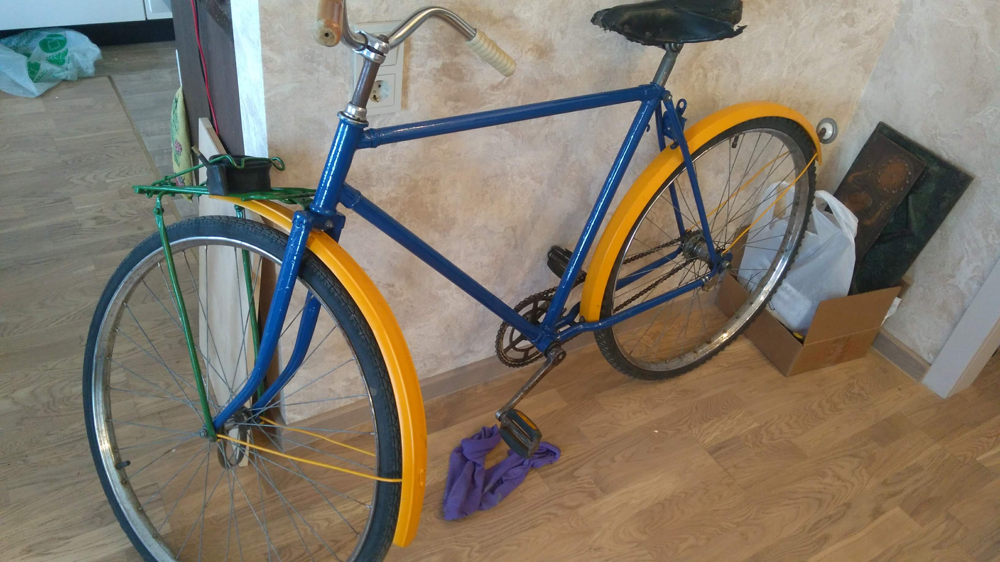

# Два велика

# Д6

## Осмотр карбюратора К34
Д6 - К34Б

Отсутстуют крышка колодца, пружина и сама дроссельная заслонка.

### Вывод
Карбюратор не рабочий - отсутствуюь некоторые части.

### Refernces
* [Устройство и принцип работы простейшего карбюратора. На примере мопедного К-34Д](https://www.youtube.com/watch?v=nRUpPDtsEjA)
* [Карбюратор К-34Б . Устройство . Регулировка . Обслуживание .](https://www.youtube.com/watch?v=87TGO_BkUvM)
* [Регулировка карбюратора К-35.](https://www.youtube.com/watch?v=9VKNmOUqnKY)

# Refernces
* [РАЗБОР ОБЗОР ДВИЖКА Д6](https://www.youtube.com/watch?v=FpoMdVomAl4)
* [РАЗБОРКА Д-6 без СЪЕМНИКОВ ! Когда НОВЫЙ коленвал - "кривее" Б/Ушного!!](https://www.youtube.com/watch?v=-T0P7CoufEE)
* [Ремонт двигателя Д6](https://www.youtube.com/watch?v=N8z_FOuV1Kc)
