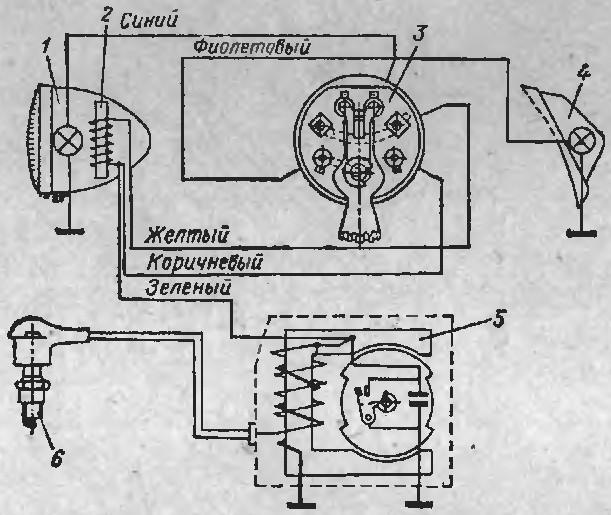

# Два велика

# Д6

## Осмотр карбюратора К34
Д6 - К34Б

Отсутстуют крышка колодца, пружина и сама дроссельная заслонка.

### Вывод
Карбюратор не рабочий - отсутствуюь некоторые части.

### Refernces
* [Устройство и принцип работы простейшего карбюратора. На примере мопедного К-34Д](https://www.youtube.com/watch?v=nRUpPDtsEjA)
* [Карбюратор К-34Б . Устройство . Регулировка . Обслуживание .](https://www.youtube.com/watch?v=87TGO_BkUvM)
* [Регулировка карбюратора К-35.](https://www.youtube.com/watch?v=9VKNmOUqnKY)

## Осмотр зажигания

По ходу электронная схема зажигания

### Вывод
Отсутсвует прокладка для крышки.\
Средний лепесток, с которого снимется искра - не прозванивается, возможно катушка сгорела.

### Refernces
* [Электрика на д6](http://www.dyr4ik.ru/forum/viewtopic.php?t=28&start=465)
* [ПРОПАЛА ИСКРА или как проверить катушку зажигания на скутере, мопеде GONE SPARK](https://www.youtube.com/watch?v=3p8osnB9zFQ)
* [Система зажигания д6, или как же всё подключить???](https://www.youtube.com/watch?v=vI1-QsDQl4w)
* [Настройка зажигания Д6 . Установка магнето .](https://www.youtube.com/watch?v=3p8osnB9zFQ)
* [РАЗБОРКА И СБОРКА ДВИЖКА РИГИ Д6](https://www.youtube.com/watch?v=Dy8zXTLWiWc)
* [Электронное зажигание на веломоторы Д6 Д8 новые дэшки дырчик](https://www.youtube.com/watch?v=yGaQ6p9ln3o)

## Осмотр корзины сцепления

### Вывод
Много ржавчины.\
Непонятен статус сухарей.\
Отсутсвует прокладка со стороны зажигания под квадратной пластиной на 4-х винтах.\
Сама прокладка явно самодельная.\
Не удалось снять малую шестерню с колен-вала.

# Refernces
* [ДЫРЧИК.РУ - Мы не торопимся](http://www.dyr4ik.ru/)
* [РАЗБОР ОБЗОР ДВИЖКА Д6](https://www.youtube.com/watch?v=FpoMdVomAl4)
* [РАЗБОРКА Д-6 без СЪЕМНИКОВ ! Когда НОВЫЙ коленвал - "кривее" Б/Ушного!!](https://www.youtube.com/watch?v=-T0P7CoufEE)
* [Ремонт двигателя Д6](https://www.youtube.com/watch?v=N8z_FOuV1Kc)
